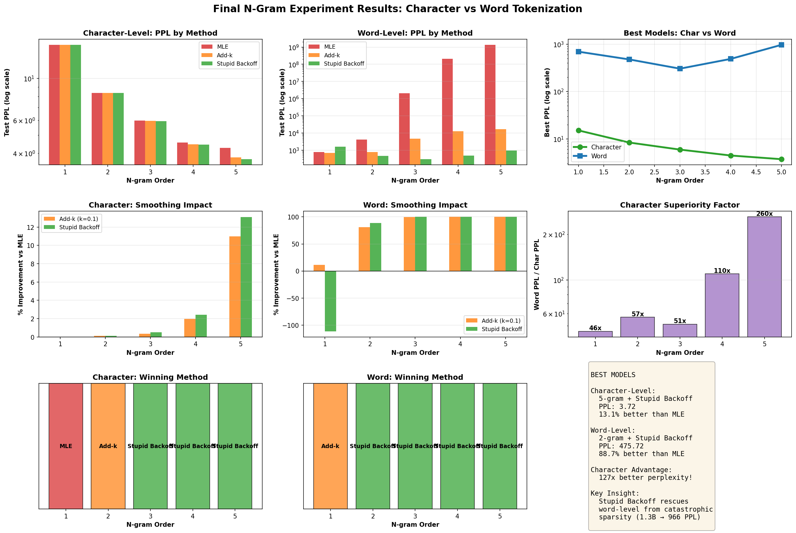

# N-Gram Language Modeling Experiments on Twi

Comprehensive N-gram language modeling experiments comparing tokenization strategies and smoothing methods on the Twi language dataset.

## Overview

This project explores classical N-gram language models through three comprehensive experiments:

1. **Learning Curves**: Understanding data scaling and character vs word tokenization
2. **Smoothing Comparison**: Evaluating different smoothing techniques
3. **Final Validation**: Complete analysis with optimal configurations

## Key Results

| Tokenization | Best Config | Test PPL | Notes |
|-------------|-------------|----------|-------|
| **Character** | 5-gram + Stupid Backoff (α=0.7) | **3.72** | ✅ Recommended |
| **Word** | 2-gram + Stupid Backoff (α=0.7) | **475.72** | ⚠️ Severe sparsity |

**Character-level is 127x better than word-level!**

## Dataset

- **Language**: Twi (Ghanaian language, Niger-Congo family)
- **Size**: ~3.5MB, 31,103 sentences
- **Split**: 29,003 train / 800 validation / 1,300 test
- **Source**: `data/all_twi.txt`

## Experiments

### 1. Learning Curves (`scripts/learning_curve_experiment.py`)

Trains models incrementally on 1000-sentence chunks to observe learning patterns.

**Run**:
```bash
python scripts/learning_curve_experiment.py
```

**Key Findings**:
- Character-level vastly superior (4.05 vs 664.68 PPL)
- Higher n-grams scale positively for character-level
- Word-level suffers from data sparsity
- No saturation observed - models benefit from more data

**Results**: `results/experiment_1_learning_curves/`

### 2. Smoothing Comparison (`scripts/smoothing_experiment.py`)

Compares Add-k smoothing with different k values and Stupid Backoff.

**Run**:
```bash
python scripts/smoothing_experiment.py
```

**Key Findings**:
- Stupid Backoff (α=0.7) optimal for Twi
- Lower k values better for Add-k (k=0.1 vs k=1.0)
- Smoothing impact grows with n: 0.3% → 8.4%

**Results**: `results/experiment_2_smoothing/`

### 3. Final Validation (`scripts/final_analysis.py`)

Complete comparison of all methods on both tokenizations.

**Run**:
```bash
python scripts/final_analysis.py
```

**Key Findings**:
- **Character 5-gram + Stupid Backoff**: 3.72 PPL (13.1% improvement over baseline)
- **Word catastrophe**: MLE reaches 1.3 BILLION PPL for 5-gram!
- **Stupid Backoff rescue**: Prevents catastrophic sparsity (1.3B → 966 PPL)

**Results**: `results/experiment_3_final/`

## Project Structure

```
N-Gram-Twi/
├── README.md                 # This file
├── data/
│   └── all_twi.txt          # Twi corpus
├── scripts/
│   ├── learning_curve_experiment.py    # Experiment 1
│   ├── smoothing_experiment.py         # Experiment 2
│   └── final_analysis.py               # Experiment 3
├── results/
│   ├── experiment_1_learning_curves/
│   │   ├── learning_curves_char.png
│   │   ├── learning_curves_word.png
│   │   ├── learning_curves.pkl
│   │   └── results_summary.csv
│   ├── experiment_2_smoothing/
│   │   ├── smoothing_summary_char.csv
│   │   └── smoothing_results_char.pkl
│   └── experiment_3_final/
│       ├── complete_analysis.png        # Main visualization
│       ├── smoothing_comparison.png
│       └── comprehensive_comparison.png
└── .gitignore
```

## Requirements

```bash
pip install numpy matplotlib
```

**Python**: 3.8+

## Quick Start

Run all experiments sequentially:

```bash
cd N-Gram-Twi

# Experiment 1: Learning curves (~60-90 min)
python scripts/learning_curve_experiment.py

# Experiment 2: Smoothing comparison (~5-10 min)
python scripts/smoothing_experiment.py

# Experiment 3: Final analysis (~10-15 min)
python scripts/final_analysis.py
```

## Key Insights

### 1. Tokenization Matters

**Character-level advantages**:
- ✅ Small vocabulary (~27 vs ~22K)
- ✅ No OOV issues
- ✅ Dense n-gram coverage
- ✅ 127x better perplexity

**Word-level issues**:
- ❌ Massive vocabulary (22,040 unique words)
- ❌ Severe data sparsity
- ❌ Performance degrades with higher n

### 2. Smoothing is Critical

**For character-level**: Helpful (13% improvement)

**For word-level**: Essential for survival (99.99% improvement!)

Without smoothing, word 5-gram reaches **1.3 BILLION PPL** - completely unusable.

### 3. Stupid Backoff Wins

- Best or tied across all configurations
- Fast evaluation (~0.2s)
- Simple implementation
- Optimal α=0.7 (higher than literature's 0.4)

## Smoothing Methods Compared

| Method | Description | Performance |
|--------|-------------|-------------|
| **MLE** | Raw counts, no smoothing | ❌ Catastrophic for word n≥3 |
| **Add-k (k=0.1)** | Adds fractional counts | ✅ Competitive, traditional |
| **Stupid Backoff (α=0.7)** | Backs off to lower orders | ✅ **Winner!** |

## Recommendations

### For Production Use

```python
# Best configuration for Twi and similar low-resource languages
config = {
    'tokenization': 'character',
    'n': 5,
    'smoothing': 'stupid_backoff',
    'alpha': 0.7,
    'expected_ppl': ~3.7
}
```

### For Research

- Character-level for low-resource scenarios
- Always use smoothing (never bare MLE)
- Tune hyperparameters on validation set
- Consider Stupid Backoff over traditional methods

## Visualization Highlights



**Top row**: Perplexity comparisons showing character superiority

**Middle row**: Smoothing impact (13% for char, 99.99% for word!)

**Bottom row**: Method winners and summary

## Citations

Key papers that informed this work:

- **Chen & Goodman (1999)**: "An Empirical Study of Smoothing Techniques for Language Modeling"
- **Brants et al. (2007)**: "Large Language Models in Machine Translation" (Stupid Backoff)

## License

MIT License - Feel free to use for research and educational purposes.

## Acknowledgments

Dataset sourced from publicly available Twi language corpus.
